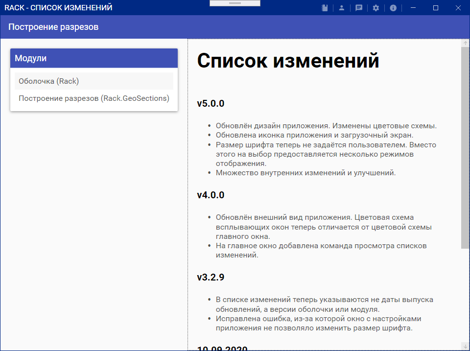
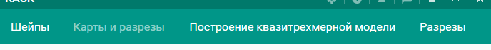
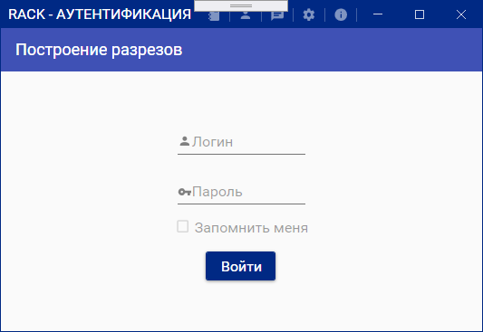

# Общая информация

Программный комплекс лаборатории геологии нефти и газа (Rack) содержит ряд модулей, каждый из которых предназначен для решения ряда определённых задач. Каждый модуль, в сущности, является отдельной программой, интегрированной в оболочку с единым пользовательским интерфейсом.

## Обновление приложения

При запуске приложения автоматически проверяется наличие обновлений. Если обнаружено доступное обновление, программа начнёт загрузку. Если загрузка обновления будет произведена успешно, программа сообщит об этом. Обновление будет применено при следующем запуске программы. 

После проверки обновлений вы автоматически перейдёте к просмотру списка изменений. Переключаясь между модулями, вы можете узнать обо всех основных изменениях, которые были получены при загрузке обновлений.  

## Меню навигации

Для начала работы с модулями выберите соответствующий пункт в меню навигации. Если какой-то пункт недоступен для выбора, то для работы соответствующего модуля требуется войти в систему под своим логином.  

## Меню приложения

Слева от стандартных элементов управления окном Windows располагается меню приложения. Каждая иконка соответствует определённой команде, которую может вызвать пользователь.  

- **Список изменений** перемещает пользователя к списку изменений.
- **Аутентификация** перемещает пользователя к форме для входа в систему.
- **Журнал сообщений** вызывает журнал, содержащий все сообщения, выданные пользователю в ходе сеанса работы в приложении.
- **Настройки** позволяют пользователям изменять параметры приложения для своих нужд в отдельном окне.
- **Справка** открывает отдельное окно с пользовательской справкой по работе с приложением и отдельными модулями.

## Аутентификация

Для работы с некоторыми модулями вам может понадобиться доступ к базам данных ЛНГИГ. Для получения доступа перейдите на форму аутентификации (см. раздел "Меню приложения", иконка человека в правом верхнем углу окна). Вам будет предложено войти в систему под своим логином и паролем.  

## Обратная связь

При некорректной работе программного комплекса или одного из модулей либо при наличии пожеланий для дальнейшего развития программного комплекса обратитесь непосредственно к разработчику программного комплекса или в лабораторию нефтегазовой геологии и геофизики.